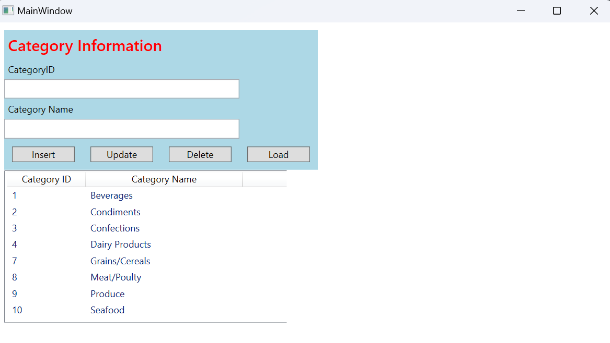

## You will find in this repo the following stuff
* A simple CRUD (Create, Read, Update, Delete) Categories Management application built using WPF and Microsoft SQL Server.
* Create new categories
* Read and display existing categories
* Update existing categories
* Delete categories
* Styled UI using WPF tags
### Screenshots
* 
### Demonstration
* 
* The reason why when I added 2 new category into the list and its id incremented to 26 and 27 respectively, that is because I have added some categories before to test this app and I use int identity type for CategoryID which auto-incremented by 1 when user added a new category.
#### Connect me via: nkluantran2907@gmail.com
##### &#169, 2024 luan.tran